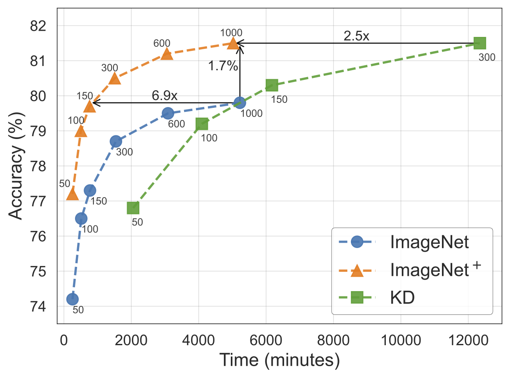

# Dataset Reinforcement
A light-weight implementation of Dataset Reinforcement, pretrained checkpoints, and reinforced datasets.

**[Reinforce Data, Multiply Impact: Improved Model Accuracy and Robustness with Dataset Reinforcement.](https://arxiv.org/abs/2303.08983)**
*, Faghri, F., Pouransari, H., Mehta, S., Farajtabar, M., Farhadi, A., Rastegari, M., & Tuzel, O.,  Proceedings of the IEEE/CVF International Conference on Computer Vision (ICCV), 2023.*


**Reinforced ImageNet, ImageNet+, improves accuracy at similar iterations/wall-clock**

<p align="center">

</p>

ImageNet validation accuracy of ResNet-50 is shown as 
a function of training duration with (1) ImageNet dataset, (2) knowledge 
distillation (KD), and (3) ImageNet+ dataset (ours). Each point is a full 
training with epochs varying from 50-1000. An epoch has the same number of 
iterations for ImageNet/ImageNet+.

**Illustration of Dataset Reinforcement**

<p align="center">

</p>

Data augmentation and 
knowledge distillation are common approaches to
improving accuracy. Dataset reinforcement combines the benefits of both by 
bringing the advantages of large models trained on large datasets to other 
datasets and models. Training of new models with a reinforced dataset is as 
fast as training on the original dataset for the same total iterations. 
Creating a reinforced dataset is a one-time process (e.g., ImageNet to 
ImageNet+) the cost of which is amortized over repeated uses.


## Requirements
Install the requirements using:
```shell
   pip install -r requirements.txt
 ```

We support loading models from Timm library and CVNets library.

To install CVNets library follow their [installation 
instructions](https://github.com/apple/ml-cvnets#installation).

## Pretrained Checkpoints

### CVNets Checkpoints

We provide pretrained checkpoints for various models in CVNets.
The accuracies can be verified using the CVNets library.

- [150 Epochs Checkpoints](./results/table_E150.md)
- [300 Epochs Checkpoints](./results/table_E300.md)
- [1000 Epochs Checkpoints](./results/table_E1000.md)
- [imagenet-cvnets.tar](https://docs-assets.developer.apple.com/ml-research/models/dr/imagenet-cvnets.tar): All CVNets checkpoints trained on ImageNet (14.3GBs).
- [imagenet-plus-cvnets.tar](https://docs-assets.developer.apple.com/ml-research/models/dr/imagenet-plus-cvnets.tar): All CVNets checkpoints trained on ImageNet+ (14.3GBs).

Selected results trained for 1000 epochs:

| Name           | Mode       | Params     | ImageNet | ImageNet+       | ImageNet (EMA) | ImageNet+ (EMA) | Links                                                                                                                                                                                                                                                                                                                                                                                                                                                                                                                                                 |
| :------------- | :--------- | :------------- | :-----   | :-----------    | :-----         | :------         | -----                                                                                                                                                                                                                                                                                                                                                                                                                                                                                                                                                 |
| MobileNetV3    | large      | 5.5M           | 74.8     | 77.9 (**+3.1**) | 75.8           | 77.9 (**+2.1**) | [[best.pt]](https://docs-assets.developer.apple.com/ml-research/models/dr/imagenet-plus-cvnets/mobilenetv3_large_E1000/best.pt) [[ema_best.pt]](https://docs-assets.developer.apple.com/ml-research/models/dr/imagenet-plus-cvnets/mobilenetv3_large_E1000/ema_best.pt) [[config.yaml]](https://docs-assets.developer.apple.com/ml-research/models/dr/imagenet-plus-cvnets/mobilenetv3_large_E1000/config.yaml) [[metrics.jb]](https://docs-assets.developer.apple.com/ml-research/models/dr/imagenet-plus-cvnets/mobilenetv3_large_E1000/metrics.jb) |
| ResNet         | 50         | 25.6M          | 80.0     | 82.0 (**+2.0**) | 80.1           | 82.0 (**+1.9**) | [[best.pt]](https://docs-assets.developer.apple.com/ml-research/models/dr/imagenet-plus-cvnets/resnet_50_E1000/best.pt)         [[ema_best.pt]](https://docs-assets.developer.apple.com/ml-research/models/dr/imagenet-plus-cvnets/resnet_50_E1000/ema_best.pt)         [[config.yaml]](https://docs-assets.developer.apple.com/ml-research/models/dr/imagenet-plus-cvnets/resnet_50_E1000/config.yaml)         [[metrics.jb]](https://docs-assets.developer.apple.com/ml-research/models/dr/imagenet-plus-cvnets/resnet_50_E1000/metrics.jb)         |
| ViT            | base       | 86.7M          | 76.8     | 85.1 (**+8.3**) | 80.8           | 85.1 (**+4.3**) | [[best.pt]](https://docs-assets.developer.apple.com/ml-research/models/dr/imagenet-plus-cvnets/vit_base_E1000/best.pt)          [[ema_best.pt]](https://docs-assets.developer.apple.com/ml-research/models/dr/imagenet-plus-cvnets/vit_base_E1000/ema_best.pt)          [[config.yaml]](https://docs-assets.developer.apple.com/ml-research/models/dr/imagenet-plus-cvnets/vit_base_E1000/config.yaml)          [[metrics.jb]](https://docs-assets.developer.apple.com/ml-research/models/dr/imagenet-plus-cvnets/vit_base_E1000/metrics.jb)          |
| ViT-384        | base       | 86.7M          | 79.4     | 85.4 (**+6.0**) | 83.1           | 85.5 (**+2.4**) | [[best.pt]](https://docs-assets.developer.apple.com/ml-research/models/dr/imagenet-plus-cvnets/vit-384_base_E1000/best.pt)      [[ema_best.pt]](https://docs-assets.developer.apple.com/ml-research/models/dr/imagenet-plus-cvnets/vit-384_base_E1000/ema_best.pt)      [[config.yaml]](https://docs-assets.developer.apple.com/ml-research/models/dr/imagenet-plus-cvnets/vit-384_base_E1000/config.yaml)      [[metrics.jb]](https://docs-assets.developer.apple.com/ml-research/models/dr/imagenet-plus-cvnets/vit-384_base_E1000/metrics.jb)      |
| Swin           | tiny       | 28.3M          | 81.3     | 84.0 (**+2.7**) | 80.5           | 83.5 (**+3.0**) | [[best.pt]](https://docs-assets.developer.apple.com/ml-research/models/dr/imagenet-plus-cvnets/swin_tiny_E1000/best.pt)         [[ema_best.pt]](https://docs-assets.developer.apple.com/ml-research/models/dr/imagenet-plus-cvnets/swin_tiny_E1000/ema_best.pt)         [[config.yaml]](https://docs-assets.developer.apple.com/ml-research/models/dr/imagenet-plus-cvnets/swin_tiny_E1000/config.yaml)         [[metrics.jb]](https://docs-assets.developer.apple.com/ml-research/models/dr/imagenet-plus-cvnets/swin_tiny_E1000/metrics.jb)         |
| Swin           | small      | 49.7M          | 81.3     | 85.0 (**+3.7**) | 81.9           | 84.5 (**+2.6**) | [[best.pt]](https://docs-assets.developer.apple.com/ml-research/models/dr/imagenet-plus-cvnets/swin_small_E1000/best.pt)        [[ema_best.pt]](https://docs-assets.developer.apple.com/ml-research/models/dr/imagenet-plus-cvnets/swin_small_E1000/ema_best.pt)        [[config.yaml]](https://docs-assets.developer.apple.com/ml-research/models/dr/imagenet-plus-cvnets/swin_small_E1000/config.yaml)        [[metrics.jb]](https://docs-assets.developer.apple.com/ml-research/models/dr/imagenet-plus-cvnets/swin_small_E1000/metrics.jb)        |
| Swin           | base       | 87.8M          | 81.5     | 85.4 (**+3.9**) | 81.8           | 85.2 (**+3.4**) | [[best.pt]](https://docs-assets.developer.apple.com/ml-research/models/dr/imagenet-plus-cvnets/swin_base_E1000/best.pt)         [[ema_best.pt]](https://docs-assets.developer.apple.com/ml-research/models/dr/imagenet-plus-cvnets/swin_base_E1000/ema_best.pt)         [[config.yaml]](https://docs-assets.developer.apple.com/ml-research/models/dr/imagenet-plus-cvnets/swin_base_E1000/config.yaml)         [[metrics.jb]](https://docs-assets.developer.apple.com/ml-research/models/dr/imagenet-plus-cvnets/swin_base_E1000/metrics.jb)         |
| Swin-384       | base       | 87.8M          | 83.6     | 85.8 (**+2.2**) | 83.8           | 85.5 (**+1.7**) | [[best.pt]](https://docs-assets.developer.apple.com/ml-research/models/dr/imagenet-plus-cvnets/swin-384_base_E1000/best.pt)     [[ema_best.pt]](https://docs-assets.developer.apple.com/ml-research/models/dr/imagenet-plus-cvnets/swin-384_base_E1000/ema_best.pt)     [[config.yaml]](https://docs-assets.developer.apple.com/ml-research/models/dr/imagenet-plus-cvnets/swin-384_base_E1000/config.yaml)     [[metrics.jb]](https://docs-assets.developer.apple.com/ml-research/models/dr/imagenet-plus-cvnets/swin-384_base_E1000/metrics.jb)     |

### Timm Checkpoints

We provide pretrained checkpoints for ResNet50d from Timm library using various reinforced datasets:

- [imagenet-timm.tar](https://docs-assets.developer.apple.com/ml-research/models/dr/imagenet-timm.tar): All Timm checkpoints trained on ImageNet and ImageNet+ (2.3GBs).

| Model                    | Reinforce Data            | Accuracy        | Links                                                                                                                                                                                                                                                                                                                                                                                                                     |
| ------------------------ | :------------------------ | :-------------: | :-----------------------------------------------------------------------------:                                                                                                                                                                                                                                                                                                                                           |
| R50d [E=150, ERM]        |                           | 78.9            | [[best.pt]](https://docs-assets.developer.apple.com/ml-research/models/dr/imagenet-timm/imagenet/best.pt)                           [[config.yaml]](https://docs-assets.developer.apple.com/ml-research/models/dr/imagenet-timm/imagenet/config.yaml)                           [[metrics.jb]](https://docs-assets.developer.apple.com/ml-research/models/dr/imagenet-timm/imagenet/metrics.jb)                           |
| R50d [E=150, NS=400]     | ImageNet+-RRC             | 80.0            | [[best.pt]](https://docs-assets.developer.apple.com/ml-research/models/dr/imagenet-timm/imagenet_plus_rrc/best.pt)                  [[config.yaml]](https://docs-assets.developer.apple.com/ml-research/models/dr/imagenet-timm/imagenet_plus_rrc/config.yaml)                  [[metrics.jb]](https://docs-assets.developer.apple.com/ml-research/models/dr/imagenet-timm/imagenet_plus_rrc/metrics.jb)                  |
| R50d [E=150, NS=400]     | ImageNet+-+M*             | 80.5            | [[best.pt]](https://docs-assets.developer.apple.com/ml-research/models/dr/imagenet-timm/imagenet_plus_mixing/best.pt)               [[config.yaml]](https://docs-assets.developer.apple.com/ml-research/models/dr/imagenet-timm/imagenet_plus_mixing/config.yaml)               [[metrics.jb]](https://docs-assets.developer.apple.com/ml-research/models/dr/imagenet-timm/imagenet_plus_mixing/metrics.jb)               |
| R50d [E=150, NS=400]     | ImageNet+-+RA/RE          | 80.4            | [[best.pt]](https://docs-assets.developer.apple.com/ml-research/models/dr/imagenet-timm/imagenet_plus_randaug/best.pt)              [[config.yaml]](https://docs-assets.developer.apple.com/ml-research/models/dr/imagenet-timm/imagenet_plus_randaug/config.yaml)              [[metrics.jb]](https://docs-assets.developer.apple.com/ml-research/models/dr/imagenet-timm/imagenet_plus_randaug/metrics.jb)              |
| R50d [E=150, NS=400]     | ImageNet+-+M*+R*          | 80.2            | [[best.pt]](https://docs-assets.developer.apple.com/ml-research/models/dr/imagenet-timm/imagenet_plus_mixing_randaug/best.pt)       [[config.yaml]](https://docs-assets.developer.apple.com/ml-research/models/dr/imagenet-timm/imagenet_plus_mixing_randaug/config.yaml)       [[metrics.jb]](https://docs-assets.developer.apple.com/ml-research/models/dr/imagenet-timm/imagenet_plus_mixing_randaug/metrics.jb)       |
| R50d [E=150, NS=100]     | ImageNet+-RRC-Small       | 80.0            | [[best.pt]](https://docs-assets.developer.apple.com/ml-research/models/dr/imagenet-timm/imagenet_plus_rrc_small/best.pt)            [[config.yaml]](https://docs-assets.developer.apple.com/ml-research/models/dr/imagenet-timm/imagenet_plus_rrc_small/config.yaml)            [[metrics.jb]](https://docs-assets.developer.apple.com/ml-research/models/dr/imagenet-timm/imagenet_plus_rrc_small/metrics.jb)            |
| R50d [E=150, NS=100]     | ImageNet+-+M*-Small       | 80.6            | [[best.pt]](https://docs-assets.developer.apple.com/ml-research/models/dr/imagenet-timm/imagenet_plus_mixing_small/best.pt)         [[config.yaml]](https://docs-assets.developer.apple.com/ml-research/models/dr/imagenet-timm/imagenet_plus_mixing_small/config.yaml)         [[metrics.jb]](https://docs-assets.developer.apple.com/ml-research/models/dr/imagenet-timm/imagenet_plus_mixing_small/metrics.jb)         |
| R50d [E=150, NS=100]     | ImageNet+-+RA/RE-Small    | 80.2            | [[best.pt]](https://docs-assets.developer.apple.com/ml-research/models/dr/imagenet-timm/imagenet_plus_randaug_small/best.pt)        [[config.yaml]](https://docs-assets.developer.apple.com/ml-research/models/dr/imagenet-timm/imagenet_plus_randaug_small/config.yaml)        [[metrics.jb]](https://docs-assets.developer.apple.com/ml-research/models/dr/imagenet-timm/imagenet_plus_randaug_small/metrics.jb)        |
| R50d [E=150, NS=100]     | ImageNet+-+M*+R*-Small    | 80.1            | [[best.pt]](https://docs-assets.developer.apple.com/ml-research/models/dr/imagenet-timm/imagenet_plus_mixing_randaug_small/best.pt) [[config.yaml]](https://docs-assets.developer.apple.com/ml-research/models/dr/imagenet-timm/imagenet_plus_mixing_randaug_small/config.yaml) [[metrics.jb]](https://docs-assets.developer.apple.com/ml-research/models/dr/imagenet-timm/imagenet_plus_mixing_randaug_small/metrics.jb) |
| R50d [E=150, NS=50]      | ImageNet+-RRC-Mini        | 80.1            | [[best.pt]](https://docs-assets.developer.apple.com/ml-research/models/dr/imagenet-timm/imagenet_plus_rrc_mini/best.pt)             [[config.yaml]](https://docs-assets.developer.apple.com/ml-research/models/dr/imagenet-timm/imagenet_plus_rrc_mini/config.yaml)             [[metrics.jb]](https://docs-assets.developer.apple.com/ml-research/models/dr/imagenet-timm/imagenet_plus_rrc_mini/metrics.jb)             |
| R50d [E=150, NS=50]      | ImageNet+-+M*-Mini        | 80.5            | [[best.pt]](https://docs-assets.developer.apple.com/ml-research/models/dr/imagenet-timm/imagenet_plus_mixing_mini/best.pt)          [[config.yaml]](https://docs-assets.developer.apple.com/ml-research/models/dr/imagenet-timm/imagenet_plus_mixing_mini/config.yaml)          [[metrics.jb]](https://docs-assets.developer.apple.com/ml-research/models/dr/imagenet-timm/imagenet_plus_mixing_mini/metrics.jb)          |
| R50d [E=150, NS=50]      | ImageNet+-+RA/RE-Mini     | 80.4            | [[best.pt]](https://docs-assets.developer.apple.com/ml-research/models/dr/imagenet-timm/imagenet_plus_randaug_mini/best.pt)         [[config.yaml]](https://docs-assets.developer.apple.com/ml-research/models/dr/imagenet-timm/imagenet_plus_randaug_mini/config.yaml)         [[metrics.jb]](https://docs-assets.developer.apple.com/ml-research/models/dr/imagenet-timm/imagenet_plus_randaug_mini/metrics.jb)         |
| R50d [E=150, NS=50]      | ImageNet+-+M*+R*-Mini     | 80.2            | [[best.pt]](https://docs-assets.developer.apple.com/ml-research/models/dr/imagenet-timm/imagenet_plus_mixing_randaug/best.pt)       [[config.yaml]](https://docs-assets.developer.apple.com/ml-research/models/dr/imagenet-timm/imagenet_plus_mixing_randaug/config.yaml)       [[metrics.jb]](https://docs-assets.developer.apple.com/ml-research/models/dr/imagenet-timm/imagenet_plus_mixing_randaug/metrics.jb)       |


## Reinforced Data

The following is a list of reinforcements for ImageNet/CIFAR-100/Food-101/Flowers-102. We recommend ImageNet+-RA/RE based on the analysis in the paper.

| Reinforce Data         | Task ID                                                                                                            | Size (GBs) | Comments      |
|------------------------|--------------------------------------------------------------------------------------------------------------------|------------|---------------|
| ImageNet+-RRC          | [rdata](https://docs-assets.developer.apple.com/ml-research/datasets/dr/imagenet_plus_rrc.tar.gz)                  | 33.4       | [NS=400]      |
| ImageNet+-+M*          | [rdata](https://docs-assets.developer.apple.com/ml-research/datasets/dr/imagenet_plus_mixing.tar.gz)               | 46.3       | [NS=400]      |
| **ImageNet+-+RA/RE**       | [rdata](https://docs-assets.developer.apple.com/ml-research/datasets/dr/imagenet_plus_randaug.tar.gz)              | 37.5       | [NS=400]      |
| ImageNet+-+M*+R*       | [rdata](https://docs-assets.developer.apple.com/ml-research/datasets/dr/imagenet_plus_mixing_randaug.tar.gz)       | 53.3       | [NS=400]      |
| ImageNet+-RRC-Small    | [rdata](https://docs-assets.developer.apple.com/ml-research/datasets/dr/imagenet_plus_rrc_small.tar.gz)            | 4.7        | [NS=100, K=5] |
| ImageNet+-+M*-Small    | [rdata](https://docs-assets.developer.apple.com/ml-research/datasets/dr/imagenet_plus_mixing_small.tar.gz)         | 7.8        | [NS=100, K=5] |
| ImageNet+-+RA/RE-Small | [rdata](https://docs-assets.developer.apple.com/ml-research/datasets/dr/imagenet_plus_randaug_small.tar.gz)        | 5.6        | [NS=100, K=5] |
| ImageNet+-+M*+R*-Small | [rdata](https://docs-assets.developer.apple.com/ml-research/datasets/dr/imagenet_plus_mixing_randaug_small.tar.gz) | 9.4        | [NS=100, K=5] |
| ImageNet+-RRC-Mini     | [rdata](https://docs-assets.developer.apple.com/ml-research/datasets/dr/imagenet_plus_rrc_mini.tar.gz)             | 4.4        | [NS=50]       |
| ImageNet+-+M*-Mini     | [rdata](https://docs-assets.developer.apple.com/ml-research/datasets/dr/imagenet_plus_mixing_mini.tar.gz)          | 6.1        | [NS=50]       |
| ImageNet+-+RA/RE-Mini  | [rdata](https://docs-assets.developer.apple.com/ml-research/datasets/dr/imagenet_plus_randaug_mini.tar.gz)         | 4.9        | [NS=50]       |
| ImageNet+-+M*+R*-Mini  | [rdata](https://docs-assets.developer.apple.com/ml-research/datasets/dr/imagenet_plus_mixing_randaug.tar.gz)       | 7.0        | [NS=50]       |
| CIFAR-100              | [rdata](https://docs-assets.developer.apple.com/ml-research/datasets/dr/cifar100.tar.gz)                           | 2.5        | [NS=800]      |
| Food-101               | [rdata](https://docs-assets.developer.apple.com/ml-research/datasets/dr/food_101.tar.gz)                           | 4.2        | [NS=800]      |
| Flowers-102            | [rdata](https://docs-assets.developer.apple.com/ml-research/datasets/dr/flowers_102.tar.gz)                        | 0.5        | [NS=8000]     |

## Training

We provide YAML configurations for training ResNet-50 in 
`CFG_FILE=configs/${DATASET}/${TRAINER}.yaml`, with the following options:
- `DATASET`: `imagenet`, `cifar100`, `flowers102`, and `food101`.
- `TRAINER`: standard training (`erm`), knowledge distillation (`kd`), and with reinforced data (`plus`).

Follow the steps:
- Choose the dataset and trainer from the choices above.
- Download ImageNet data and set `data_path` in `$CFG_FILE`.
- Download reinforcement metadata and set `reinforce.data_path` in `$CFG_FILE`.

```shell
python train.py --config configs/imagenet/erm.yaml  # ImageNet training without Reinforcements (ERM)
python train.py --config configs/imagenet/kd.yaml  # Knowledge Distillation
python train.py --config configs/imagenet/plus.yaml  # ImageNet+ training with reinforcements
```

Hyperparameters such as batch size for ImageNet training are optimized for 
running on a single node with 8xA100 40GB GPUs. For 
CIFAR-100/Flowers-102/Food-101, the configurations are optimized for training 
on a single GPU.

## Reinforce ImageNet

Follow the steps:
- Download ImageNet data and set `data_path` in `$CFG_FILE`.
- If needed, change the teacher in `$CFG_FILE` to a smaller architecture.

```shell
python reinforce.py --config configs/imagenet/reinforce/randaug.yaml
```

## Reference

If you found this code useful, please cite the following paper:

    @InProceedings{faghri2023reinforce,
        author    = {Faghri, Fartash and Pouransari, Hadi and Mehta, Sachin and Farajtabar, Mehrdad and Farhadi, Ali and Rastegari, Mohammad and Tuzel, Oncel},
        title     = {Reinforce Data, Multiply Impact: Improved Model Accuracy and Robustness with Dataset Reinforcement},
        booktitle = {Proceedings of the IEEE/CVF International Conference on Computer Vision (ICCV)},
        month     = {October},
        year      = {2023},
    }

## License
This sample code is released under the [LICENSE](LICENSE) terms.
